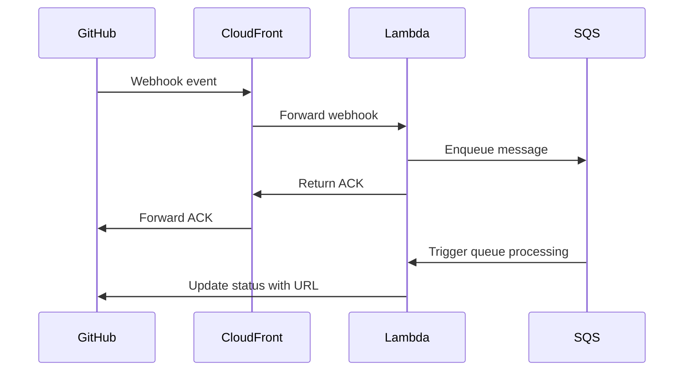

# ❤️‍🔥 Contributing to this project

Thank you for your interest in contributing to **Prevstat**.

## 🐛 Reporting issues

Please report issues in our [GitHub repository](https://github.com/lasuillard-s/prevstat/issues). Before submitting an issue, search for existing issues to avoid duplicates.

## 🏗️ Project overview

This project is a GitHub App built with [Probot](https://probot.github.io/) and TypeScript. It watches your repository for workflow completion and downloads artifacts to host temporarily on Amazon S3 and serve them via CloudFront so that you can view them in your browser.

### 🛠️ Tech stack

This project uses the following tech stack:

- [TypeScript](https://www.typescriptlang.org/) on [Node.js](https://nodejs.org/) 24+
- [Probot](https://probot.github.io/) for the GitHub App runtime
- [Vitest](https://vitest.dev/), [ESLint](https://eslint.org/), and [Prettier](https://prettier.io/) for testing and code quality

### 📂 Key directory structure

- `src/`: Application source code
- `src/event-handlers/`: Event handlers for GitHub webhook events
- `src/routes/api`: API routes such as authentication to issue signed cookies for CloudFront
- `src/routes/aws`: AWS-related internal routes such as background tasks for processing artifacts
- `src/lib/`: Project-specific libraries
- `src/utils/`: Utility functions and helpers
- `test/`: Unit tests and fixtures
- `app.yaml`: GitHub App manifest
- `flake.nix`: Nix Flake configuration for the development environment
- `Justfile`: Development and maintenance commands

## 🔧 Set up the development environment

This repository uses `nix` to manage dependencies and development tools. Run `nix develop` to set up a local development environment, then run `just install` to install dependencies.

> [!NOTE]
> You will need Docker to run the tests (testcontainers). This is not installed via `nix` because it requires root privileges. Please install it separately.

The following tools will be installed and managed by `nix`:

- `pre-commit`
- `just` command runner
- Node.js 24.x
- `ngrok` for webhook testing
- `terraform` for deployment
- `awscli2` (`aws` command)

If you prefer a Dev Container, an example configuration is available in [.devcontainer.example/devcontainer.json](.devcontainer.example/devcontainer.json). Copy it to `.devcontainer/devcontainer.json` to use it locally.

## ✅ Verifying changes

Before pushing your code, run `just ci` to verify formatting, linting, type checking, and tests.

## ✨ Submitting changes

Please submit pull requests on GitHub. Before opening a PR, make sure your changes pass the relevant checks locally.

## 🚀 Release process

This project is provided as-is. The intended use is to fork or clone the source code and deploy it to AWS using Terraform. See [deploy/terraform-aws/README.md](deploy/terraform-aws/README.md) for more information.
