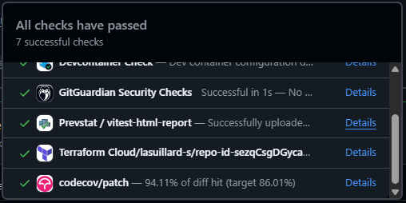
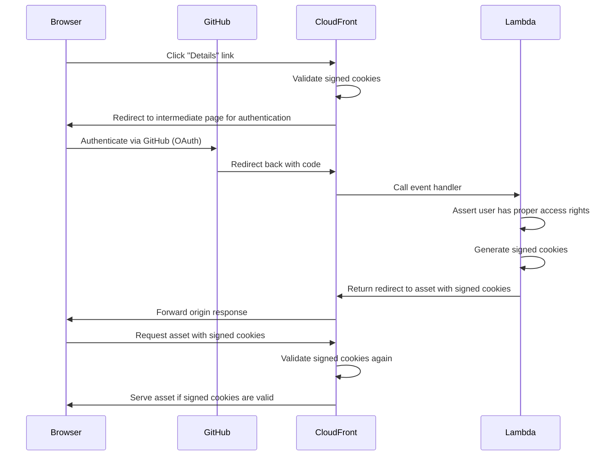

# Prevstat

PREView any STATic assets in your browser, instantly and securely.

## ✨ Features

> [!IMPORTANT]
> This project is provided as-is. We do not offer any GitHub App for installation. To use it, you will need to deploy it by yourself.

Prevstat is a GitHub App built with [Probot](https://probot.github.io/) with the purpose of solving the below issues:

- **One-click instant access** to your test artifacts in the browser
- **Centralized installation**, no workflow to write and maintain for each repository
- **Secure browsing**: your private repositories without exposing them publicly

## ❓ How it works

When you click the **"Details"** link, CloudFront will serve it without authentication if it is public. For private assets, you will need to authenticate via GitHub before accessing them:

Workflow artifact is matched by the patterns in the app configuration. You need to update your workflow to upload the artifact and update the app configuration accordingly.

## 🚀 Deploying the application

> [!NOTE]
> A GitHub App must be created before deployment so that its credentials can be supplied. After deployment, follow the linked guide to configure its webhook and OAuth callback URLs from the Terraform outputs.

Please refer to the [`deploy/terraform-aws`](./deploy/terraform-aws) guide for instructions on deploying the application.

## ⚙️ Configuration

The most important environment variables are below. See [`.env.example`](./.env.example) and [`src/config.ts`](./src/config.ts) for the full list and defaults.

| Key                                           | Description                                                                                                                                                                                   |
| --------------------------------------------- | --------------------------------------------------------------------------------------------------------------------------------------------------------------------------------------------- |
| `GITHUB_CLIENT_ID`                            | The client ID of your GitHub OAuth App.                                                                                                                                                       |
| `GITHUB_CLIENT_SECRET`                        | The client secret of your GitHub OAuth App.                                                                                                                                                   |
| `ALLOWED_PRINCIPALS`                          | A comma-separated list of GitHub usernames or organizations allowed to install the GitHub App. Defaults to `*` (no restrictions). If empty, no one will be allowed to install the GitHub App. |
| `CLOUDFRONT_DOMAIN`                           | The domain name of your CloudFront distribution.                                                                                                                                              |
| `CLOUDFRONT_PRIVATE_KEY`                      | The private key used for signing CloudFront cookies.                                                                                                                                          |
| `CLOUDFRONT_SIGNED_COOKIE_EXPIRATION_SECONDS` | The expiration time (in seconds) for the signed CloudFront cookies.                                                                                                                           |
| `ORIGIN_VERIFY_SECRET`                        | The secret used to verify the origin of requests.                                                                                                                                             |
| `S3_BUCKET_NAME`                              | The name of the S3 bucket where artifacts are stored.                                                                                                                                         |
| `SQS_QUEUE_URL`                               | The URL of the SQS queue for processing events.                                                                                                                                               |
| `JWT_SECRET`                                  | The secret key used for signing JWT tokens.                                                                                                                                                   |
| `JWT_EXPIRATION_SECONDS`                      | The expiration time (in seconds) for JWT tokens.                                                                                                                                              |
| `ARTIFACT_PATTERNS`                           | The patterns used to match workflow artifacts.                                                                                                                                                |

## 💖 Contributing

Please refer to [CONTRIBUTING.md](./CONTRIBUTING.md) for more information about contributing to this project.

## 📜 License

Copyright (C) 2026 Yuchan Lee

This project is licensed under the GNU General Public License v3.0. See the [LICENSE](./LICENSE) file for more details.
