# Deploy to AWS with Terraform

In this guide, we will walk you through the steps to deploy your application to AWS using Terraform.

Here, we will use Terraform Cloud as the state backend because it offers 500 managed resources for free and it is easy to set up.

Application build and deployment is driven by Terraform. It uploads the application to S3 (`aws_s3_object` resource), starts CodeBuild (`aws_codebuild_start_build` action) then deploys the Lambda function referring to the build artifact. You don't need to set up a CI/CD pipeline for this project. Terraform will handle the build and deployment for you.

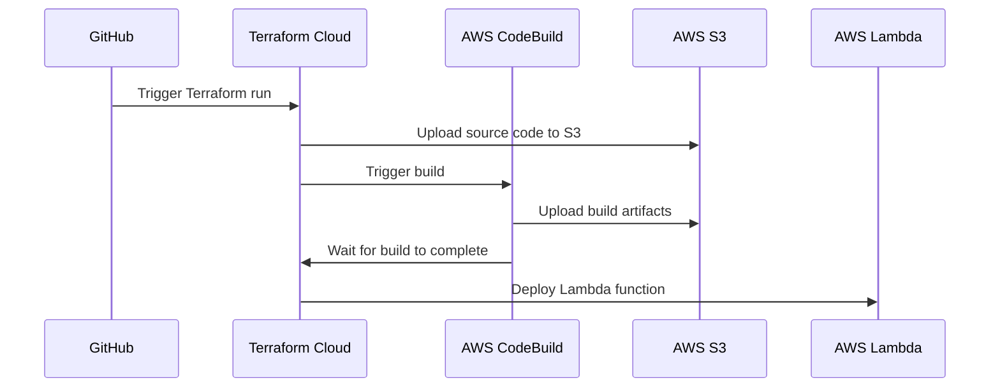

## Create a workspace in Terraform Cloud

First, create a new workspace in Terraform Cloud with **Version Control Workflow**.

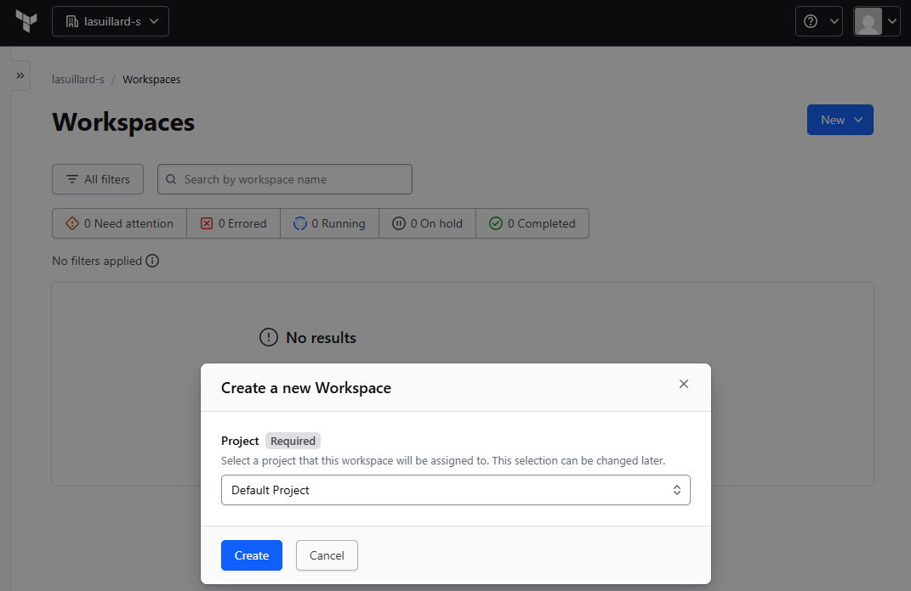

Then select **Version Control Workflow**.

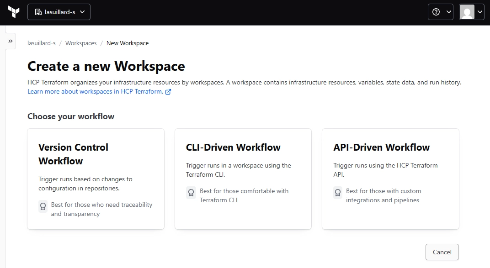

## Connect your repository

Now, if you have not connected your repository, install the Terraform GitHub App on your account or organization first:

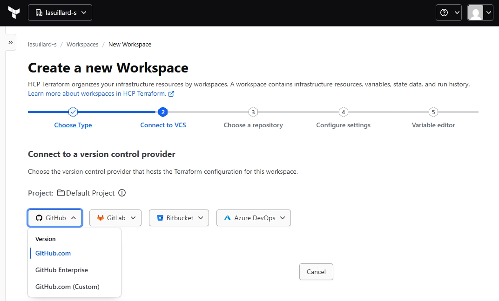

Then choose your repository (fork or clone),

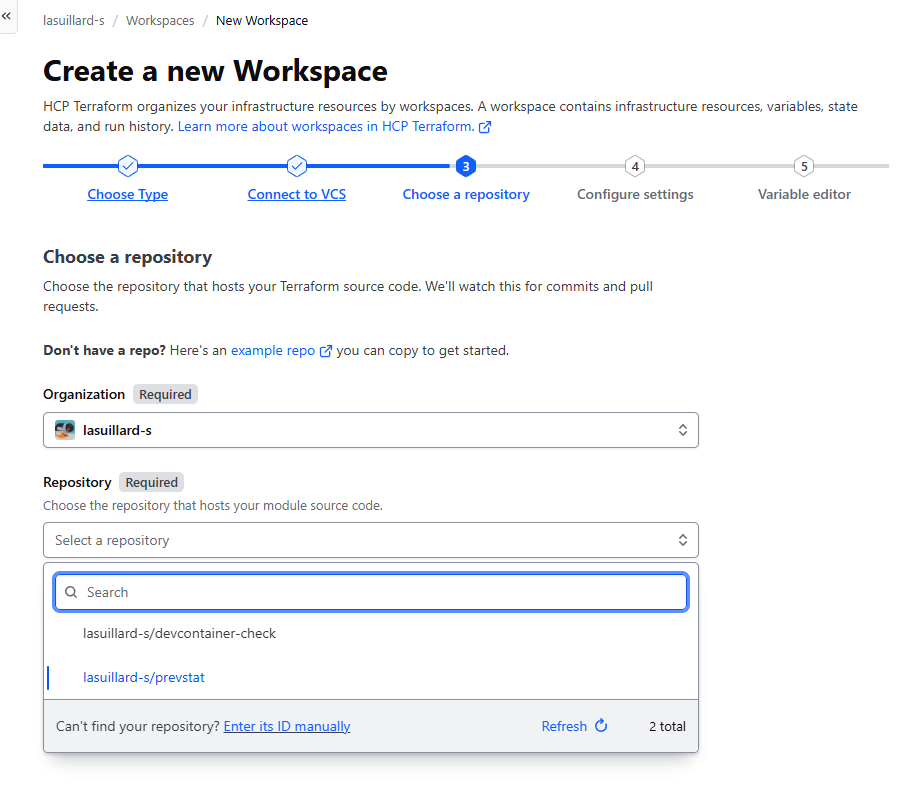

## Configure your workspace

Click **Advanced options** below and set the **Terraform working directory** to `deploy/terraform-aws`.

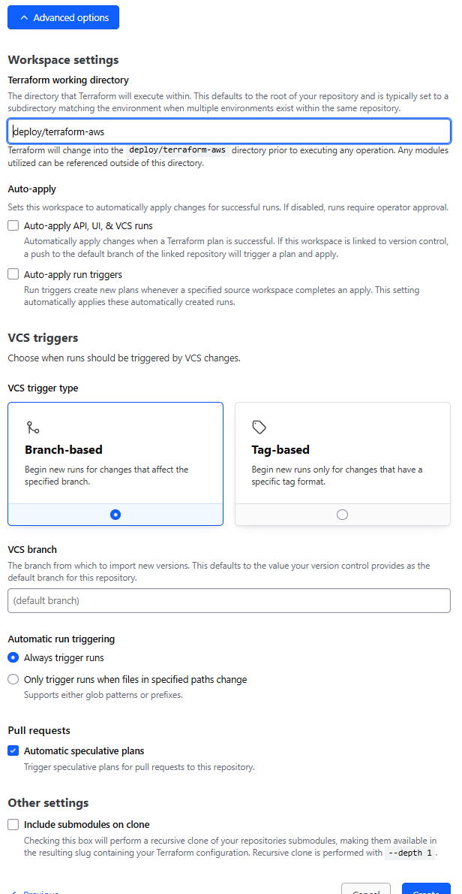

You will be prompted to add variables to your workspace, as follows:

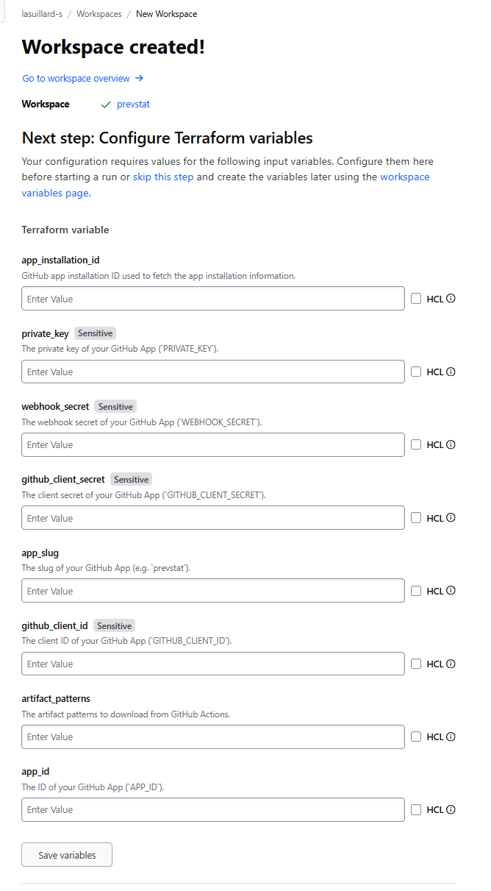

For variables Terraform Cloud does not catch, you can add them manually on the **Variables** page of your workspace.

## Set up AWS integration

At this time, if you trigger a plan, it should **FAIL** because we have not set up AWS integration (you will see the error below).

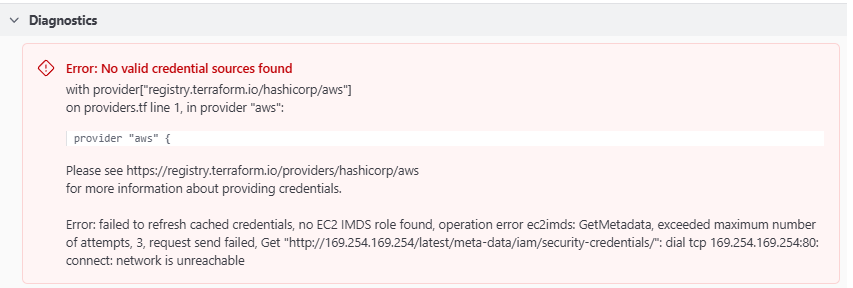

Here, we will use Dynamic Credentials feature of Terraform Cloud. Please follow the guide: [Use dynamic credentials with the AWS provider](https://developer.hashicorp.com/terraform/cloud-docs/dynamic-provider-credentials/aws-configuration).

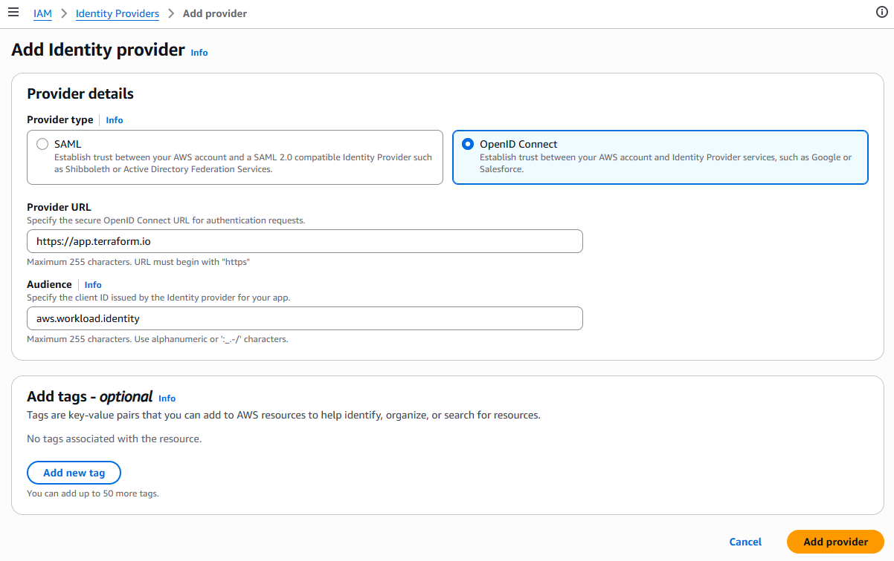

And create IAM role:

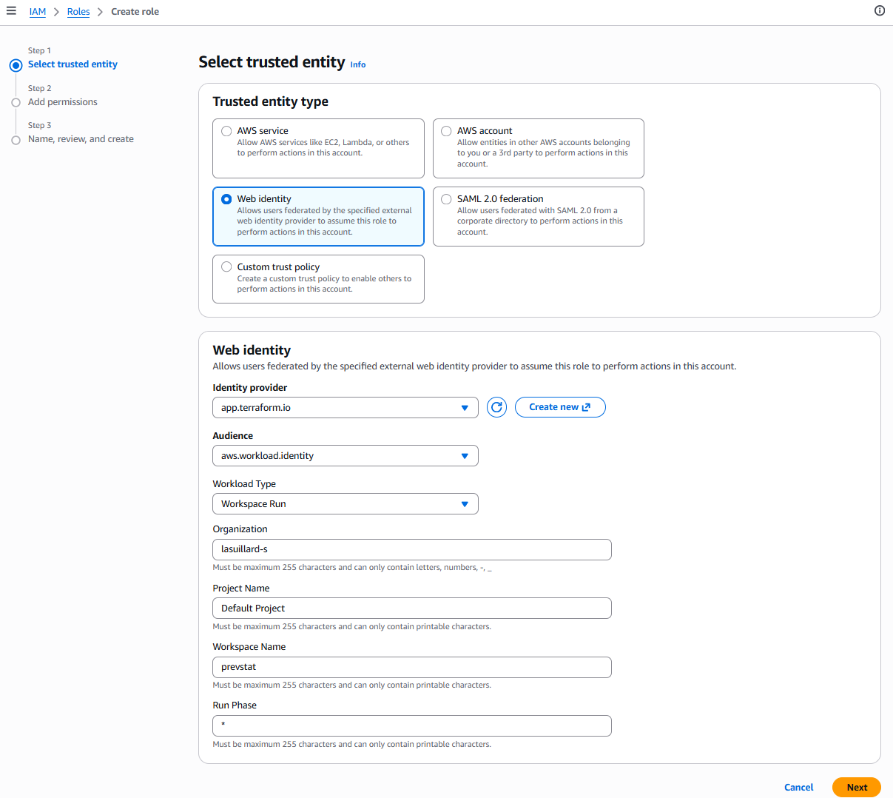

Then set environment variables in your workspace:

| Variable                | Value            |
| ----------------------- | ---------------- |
| `TFC_AWS_PROVIDER_AUTH` | `true`           |
| `TFC_AWS_RUN_ROLE_ARN`  | `<IAM role ARN>` |
| `AWS_REGION`            | `<AWS region>`   |

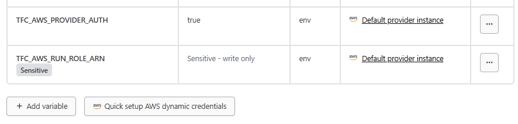

We will not cover AWS setup in detail here. Please refer to AWS documentation for more information on how to create an IAM role and set up trust relationship.

## Deploy the app

> [!NOTE]
> CloudFront Flat-Rate plan is not supported by the Terraform AWS provider for now ([terraform-provider-aws#45450](https://github.com/hashicorp/terraform-provider-aws/issues/45450)). You will need to update the CloudFront distribution settings manually to use the Flat-Rate plan (such as Free, to prevent unwanted expenses).

Click **New run** and start a speculative plan to deploy the app to AWS.

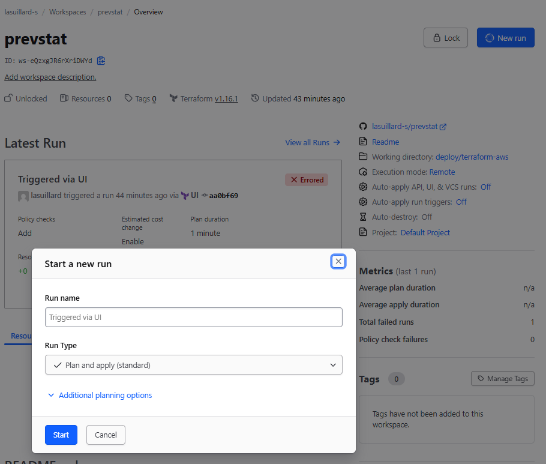

Review the plan and click **Confirm & apply** to deploy the app to AWS.

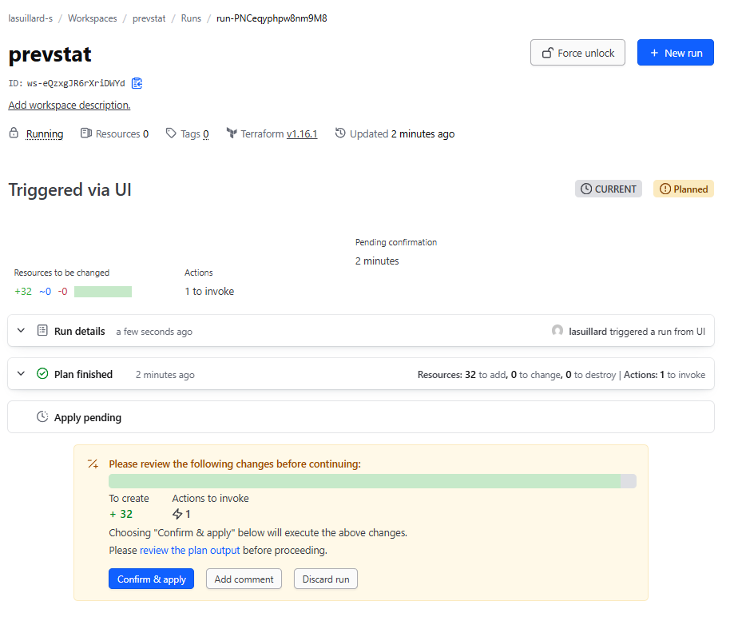

## Update your GitHub App configuration

Now you need to update your GitHub App configuration to receive events from GitHub. You can find the webhook URL in the outputs of your Terraform run.

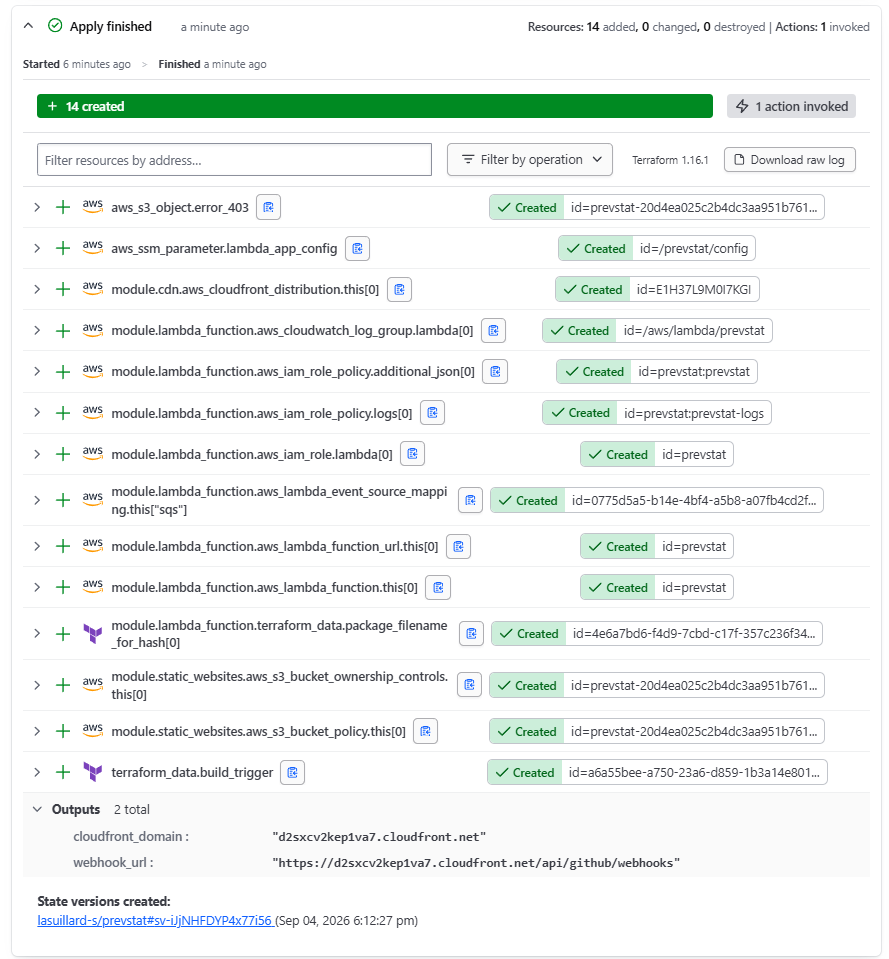

... and update your GitHub App configuration with the new webhook URL.

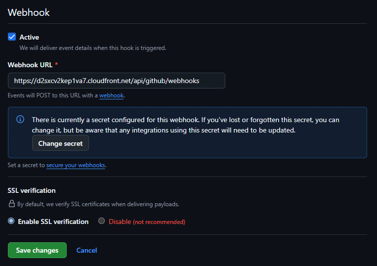
